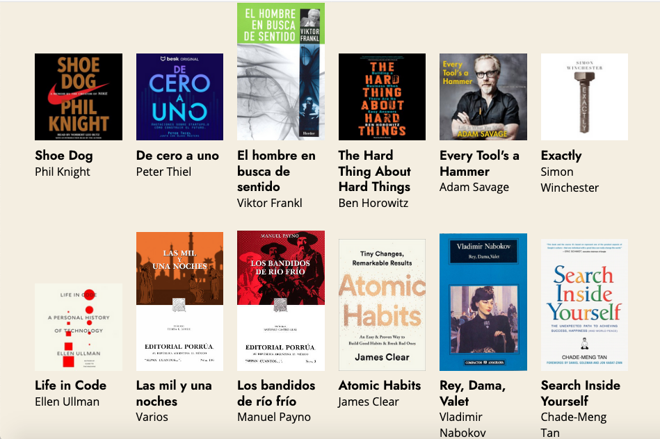

# This is my bookshlef
Here you will find:
* Books I'm reading
* Books I've read
* Books I want to read
* My book wishlist

[comment]: # (bells and whistles - features of the app)

## Why a bookshelf?
I love reading and have books everywhere, and there are many books that have caught my eye and this app is intended to keep track of all of them in one place.

## Tech Stack

## Project preview

